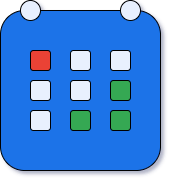

# Silviagenda

Silviagenda is a clone of Google Calendar. Made with Spring Boot, MySQL, Angular and Redis. You can create your personal
calendar, insert commitments and share it with your friends using a link. The application is available through any web
browser.

    

